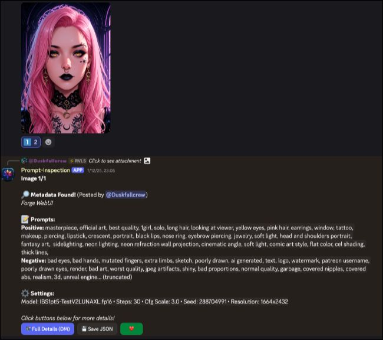
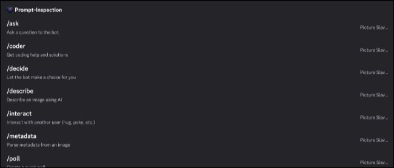
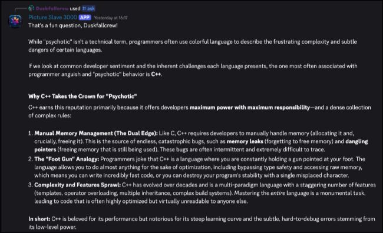
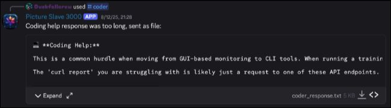
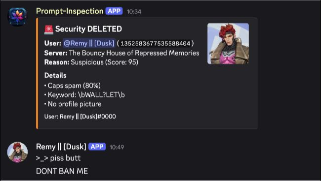

# Prompt Inspector 🔎

A Discord bot that extracts AI image-generation metadata (Forge/A1111, ComfyUI, SwarmUI, and more) **and** keeps servers safe with automated anti-spam/anti-scam moderation. Per-server configurable, with optional AI commands.

> **Now written in TypeScript / Node.js.** (The original was Python — the codebase has since been fully rewritten.)

[](https://railway.com/deploy/OCA5uC?referralCode=EQxw4P&utm_medium=integration&utm_source=template&utm_campaign=generic)

## 📑 Table of Contents

- [Features](#features)
- [Screenshots](#screenshots)
- [Quick Start](#quick-start)
- [Data & Persistence](#data--persistence-important-for-hosted-deploys)
- [Per-Server Settings](#per-server-settings)
- [How to Use](#how-to-use)
- [Security System](#security-system)
- [Guild Allowlist](#guild-allowlist-owner-cost-control)
- [AI Provider Setup](#ai-provider-setup)
- [R2 Upload Feature](#r2-upload-feature-optional)
- [Configuration](#configuration)
- [Permissions](#permissions)
- [Troubleshooting](#troubleshooting)
- [Forking This Bot](#forking-this-bot)
- [Legal](#legal)
- [Credits](#credits)

---

## Features

### Core

- 🔍 **Comprehensive metadata parsing** — Forge/A1111, 200+ ComfyUI nodes (FLUX, PixArt, Griptape, etc.), SwarmUI, NovelAI, InvokeAI, DrawThings, and more
- 1️⃣2️⃣3️⃣ **Multiple interaction styles** — numbered emoji reactions, slash commands, or right-click context menus
- 📦 **Batch handling** — 6+ images collapse to a single 📦 reaction
- 👥 **PluralKit-aware** — recognises proxied messages (work in progress for some commands)
- ✨ **JPEG/WebP support** — optional Cloudflare R2 flow for formats Discord strips metadata from

### Moderation (anti-spam / anti-scam)

- 🛡️ **Behaviour-based scam detection** — crypto/wallet spam scoring
- 🖼️ **Screenshot-spam protection** — 4+ images cross-posted across channels → ban
- 🔣 **Obfuscation detection** — zero-width / zalgo / homoglyph "algo-speak" used to evade filters
- 🔒 **Malware prevention** — magic-bytes check on attachments and embeds
- 🗂️ **Cross-server ban registry** — known bad actors and scam fingerprints are remembered across servers the bot runs in
- 🧰 **Admin tools** — `/report`, `/banregistry`, configurable word filters

### Per-server configuration

- ⚙️ **`/settings` panel** — admins toggle features and configure moderation routing per server, no bot-owner involvement
- 🎛️ Set the alert channel, trusted roles/users, monitored channels, and catcher role — all per server

### Optional AI (off by default in most cases, opt-in per server)

- ✨ **`/describe`** — AI image descriptions (Danbooru tags or natural language)
- 💬 **`/ask`** — conversational AI with per-user context
- 💬 **`/coder`** / **`/techsupport`** / **`/promptsupport`** — focused assistants
- 🔄 **Three providers** — Groq, Claude, and Gemini with automatic fallback

### Fun & utility

- 🎲 `/decide`, `/poll`, `/wildcard`, `/goodnight`, `/interact`
- ⏰ `/remind` (one-time or recurring) and a Question-of-the-Day system

---

## Screenshots

<table>
  <tr>
    <td width="50%"><br><b>Metadata extraction</b></td>
    <td width="50%"><br><b>Reactions &amp; selection</b></td>
  </tr>
  <tr>
    <td width="50%"><br><b>AI chat (/ask)</b></td>
    <td width="50%"><br><b>Coding help (/coder)</b></td>
  </tr>
  <tr>
    <td colspan="2" align="center"><br><b>Automated moderation</b></td>
  </tr>
</table>

---

## Quick Start

This is a **Node.js / TypeScript** project (Node 22+).

<details>
<summary><b>Local Setup</b></summary>

```bash
# Clone and install
git clone https://github.com/Ktiseos-Nyx/PromptInspectorBot.git
cd PromptInspectorBot
npm install

# Configure
cp config.example.toml config.toml   # optional; env vars take precedence
# Put at least BOT_TOKEN in a .env file

# Run in dev (ts-node)
npm run dev

# Or build + run compiled
npm run build
npm start

# Tests
npm test
```

</details>

<details>
<summary><b>Docker</b></summary>

```bash
docker build -t prompt-inspector-bot .

# Mount a volume so persistent data survives restarts (see Data & Persistence)
docker run -d --env-file .env \
  -e DATA_DIR=/data -v prompt-inspector-data:/data \
  prompt-inspector-bot
```

</details>

<details>
<summary><b>Railway</b></summary>

1. Click the **Deploy on Railway** button above.
2. Set `BOT_TOKEN` (and any optional keys) in the service variables.
3. **Add a Volume**, mount it at `/data`, and set `DATA_DIR=/data` — otherwise settings and the ban registry reset on every redeploy (see [Data & Persistence](#data--persistence-important-for-hosted-deploys)).

</details>

<details>
<summary><b>Environment Variables (minimum)</b></summary>

```env
BOT_TOKEN=your_discord_bot_token

# Optional — enable AI features by adding any of these
GROQ_API_KEY=your_groq_key
ANTHROPIC_API_KEY=your_claude_key
GEMINI_API_KEY=your_gemini_key

# Recommended on hosted/ephemeral platforms
DATA_DIR=/data
```

</details>

---

## Data & Persistence (important for hosted deploys)

The bot stores state in JSON files: `guild_settings.json` (per-server settings),
`ban-registry.json` (cross-server ban/scam registry), `schedules.json` (reminders / QOTD),
and `reports.json`. All of these resolve under **`DATA_DIR`** (default: the working
directory).

> ⚠️ **On ephemeral hosts like Railway, the container disk is wiped on every redeploy.**
> Mount a persistent **volume** and set `DATA_DIR` to it (e.g. `/data`), or per-server
> settings and the ban registry will reset each deploy.

What persists (and why): the moderation/safety record (banned user IDs, reasons, scam
fingerprints), per-server configuration, and any reminders. See the
[Privacy Policy](PRIVACY.md) for the full data story.

---

## Per-Server Settings

Run **`/settings`** (requires **Manage Server**) to open an interactive panel. It's paged:

| Page | What you configure |
| ---- | ------------------ |
| **Moderation** | Anti-scam on/off, alert channel, trusted roles, monitored channels |
| **AI & Metadata** | Toggle metadata extraction and each AI command |
| **Fun** | Toggle fun commands, `/interact`, QOTD |
| **Advanced** | Catcher role (extra scam weight when it's a user's only role) |

Everything is per server and persists immediately. Where a server hasn't set a value, the
bot falls back to the global environment defaults.

---

## How to Use

### Metadata inspection

1. **Post an image** in a monitored channel.
2. **Click the reactions** the bot adds — 1️⃣–5️⃣ for individual images, 📦 for 6+.
3. **Or use:** `/metadata <image>`, or right-click an image → **Apps → View Prompt**.

### Moderation & reports

- Automated moderation runs in monitored servers when **Anti-scam** is enabled.
- `/report file <user> <reason>` — members report bad actors; enough unique reports auto-times-out the target and alerts mods.
- `/banregistry` — mods view/manage the cross-server ban + pattern registry.

### AI (if enabled for the server)

- `/ask <question>` — chat with per-user context
- `/describe <image>` — AI tags/description

---

## Security System

<details>
<summary><b>🛡️ How moderation works</b></summary>

### Scam scoring → action

| Score | Action |
| ----- | ------ |
| **100+** | Instant ban; message deleted, recent messages purged |
| **75–99** | Message deleted + admins alerted |

Signals include currency symbols / hoisting characters / auto-generated usernames, ALL-CAPS
crypto spam, wallet/SOL/"dead tokens" keywords, missing avatar, and role shape (e.g. a user
whose only role is the configured **catcher** role).

### Other detections

- **Screenshot spam** — 4+ images cross-posted to 2+ channels → ban (or ban on no-roles + gibberish)
- **Algo-speak / obfuscation** — zero-width, zalgo, and Cyrillic-homoglyph evasion; combined with cross-posting → ban
- **Cross-posting** — the same message fingerprinted across 2+ channels
- **Magic bytes** — executables disguised as images, in both attachments and embeds
- **Word filters** — admin-defined patterns with `warn` / `delete` / `ban` actions
- **Ban registry** — banned users and scam fingerprints are shared across every server the bot instance runs in; joins by known bad actors alert mods

### Automatic bypasses

- ✅ Server owner
- ✅ Trusted users and **trusted roles** (set per server via `/settings`)

</details>

---

## Guild Allowlist (owner cost control)

Set **`ALLOWED_GUILD_IDS`** (comma-separated) to restrict where the bot will run. When the
list is **non-empty**, the bot leaves any server that isn't on it — both on invite and via a
startup sweep. When the list is **empty**, the bot runs anywhere (open mode). This is an
owner/env setting, not something server admins can change.

> Before deploying with an allowlist, make sure **every** server you want kept (including
> your own) is in the list, or the startup sweep will leave it.

---

## AI Provider Setup

<details>
<summary><b>🤖 Groq + Claude + Gemini</b></summary>

Set keys for whichever providers you want; the bot auto-detects them and falls back in
priority order.

```env
GROQ_API_KEY=your_groq_key
ANTHROPIC_API_KEY=your_claude_key
GEMINI_API_KEY=your_gemini_key

# Try these in order; only available providers are used
LLM_PROVIDER_PRIORITY=groq,claude,gemini
```

Defaults (override via env or `config.toml`):

```env
GROQ_PRIMARY_MODEL=llama-3.3-70b-versatile
CLAUDE_PRIMARY_MODEL=claude-haiku-4-5-20251001
GEMINI_PRIMARY_MODEL=gemini-2.5-flash
```

### Artistic / NSFW content

If Gemini's safety filters block artistic (PG-13/R) descriptions, route `/describe` to
Claude instead:

```env
NSFW_PROVIDER_OVERRIDE=claude
```

</details>

---

## R2 Upload Feature (Optional)

<details>
<summary><b>📤 Cloudflare R2 integration</b></summary>

Discord strips metadata from JPEG/WebP. The optional R2 flow lets users upload those
formats so the bot can read the metadata server-side.

```env
R2_ACCOUNT_ID=your_account_id
R2_ACCESS_KEY_ID=your_access_key
R2_SECRET_ACCESS_KEY=your_secret_key
R2_BUCKET_NAME=your_bucket_name
UPLOADER_URL=https://your-pages.pages.dev/uploader.html
```

1. Create an R2 bucket in Cloudflare.
2. Deploy `uploader.html` to Cloudflare Pages and point `UPLOADER_URL` at it.
3. Set a lifecycle rule (e.g. delete `uploads/` objects after 30 days).

All five variables must be set for the feature to activate.

</details>

---

## Configuration

<details>
<summary><b>⚙️ Environment variables</b></summary>

Resolution order: environment variable → `config.toml` → built-in default.

```env
# Discord
BOT_TOKEN=...
ALLOWED_GUILD_IDS=123,456          # empty = run anywhere
MONITORED_CHANNEL_IDS=             # global fallback; prefer per-server /settings
SCAN_LIMIT_BYTES=10485760          # 10 MB

# Moderation routing (global fallback; per-server values set via /settings win)
ADMIN_CHANNEL_IDS=123,456          # where alerts go
TRUSTED_USER_IDS=123,456
CATCHER_ROLE_ID=...

# AI
GROQ_API_KEY= / ANTHROPIC_API_KEY= / GEMINI_API_KEY=
LLM_PROVIDER_PRIORITY=groq,claude,gemini
NSFW_PROVIDER_OVERRIDE=

# Persistence
DATA_DIR=/data                     # set to a mounted volume on hosted deploys
```

</details>

---

## Permissions

**Required:** View Channel, Send Messages, Read Message History, Add Reactions, Attach Files.

**For moderation:** Ban Members, Moderate Members (timeouts), Manage Messages.

---

## Troubleshooting

<details>
<summary><b>Common issues</b></summary>

- **Settings reset after a redeploy** → you're on an ephemeral host without a volume. Set `DATA_DIR` to a mounted volume (see [Data & Persistence](#data--persistence-important-for-hosted-deploys)).
- **`/describe` or `/ask` not working** → set at least one of `GROQ_API_KEY` / `ANTHROPIC_API_KEY` / `GEMINI_API_KEY`, and make sure the AI feature is enabled in `/settings`.
- **Images not processed** → check the format/size, and whether the channel is in the server's monitored channels.
- **Anti-scam catching a legit user** → add them to trusted users/roles via `/settings`; owners are always trusted.
- **Alerts going nowhere** → set the alert channel in `/settings` (or `ADMIN_CHANNEL_IDS` as a global fallback).

</details>

---

## Forking This Bot

<details>
<summary><b>🍴 Notes for forks</b></summary>

If you fork this bot, update anything personal to the upstream project:

- **Support / donation links** — search the codebase and `uploader.html` for our Discord
  invites and Ko-fi links and replace them with your own.
- **Bot identity** — the bot works under your own `BOT_TOKEN`; renaming the application or
  bot user in the Discord Developer Portal does not require code changes.
- **Persistence** — set `DATA_DIR` (and a volume) for your own deployment.

Contributions back via pull request are welcome. Run `npm test` and `npm run build` before
opening one.

</details>

---

## Legal

- 📄 **[Privacy Policy](PRIVACY.md)** — what we process and what we keep
- 📜 **[Terms of Service](TERMS_OF_SERVICE.md)** — the rules

**Honest summary:** images, prompts, and extracted metadata are **not** stored — they're
processed and deleted. The bot **does** keep operational data to do its job: a
moderation/safety record (the cross-server ban registry) and each server's settings.
Automated moderation can delete messages and ban users. Optional AI commands send content
to third-party providers (Groq / Claude / Gemini) only when a server has enabled them.

**Support:**
- AI-free space — Earth and Dusk: https://discord.gg/5t2kYxt7An
- AI-friendly space — Ktiseos Nyx AI&ML: https://discord.gg/HhBSvM9gBY

---

## Credits

- **Icon:** <a href="https://www.flaticon.com/free-icons/flower" title="flower icons">Flower icons created by Icongeek26 - Flaticon</a> (base icon, modified for this bot).
- Originally a fork of [PromptInspectorBot](https://github.com/sALTaccount/PromptInspectorBot); since rewritten in TypeScript with substantial added features.
